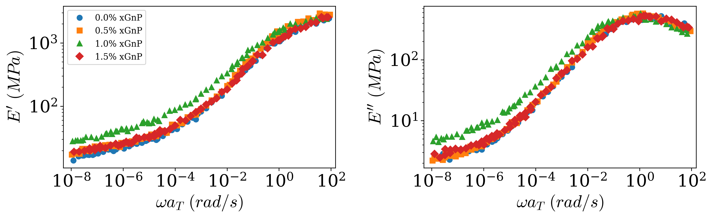
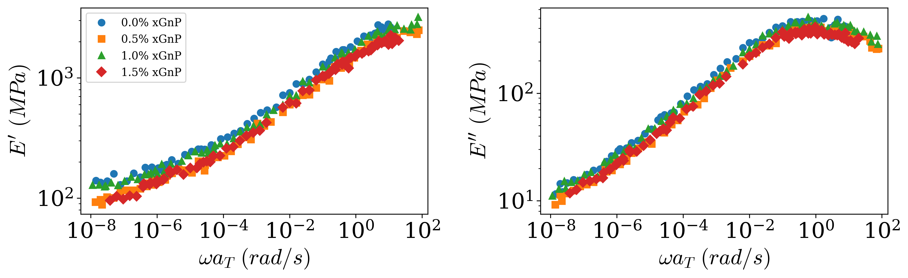
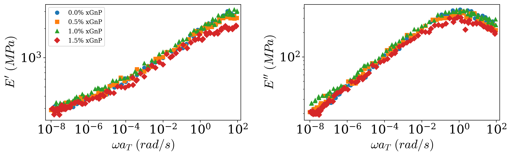

# Experimental Characterization

Based on the actual experimental data, corresponding synthesized data were produced for each nanocomposite sample. Given the limitations on sharing the actual experimental data, these synthesized datasets are provided to ensure the workflow in this repository is functional. Figures 1-3 depicts these synthesized data.

